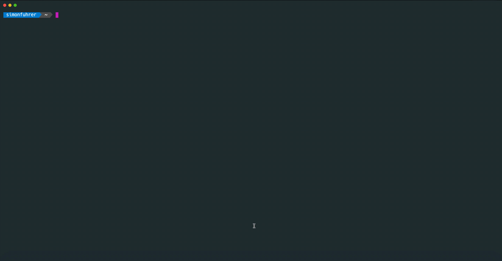

# nutactl: a cli for nutanix prism


`nutactl` is a command-line utility for nutanix prism.




# Docs
## nutactl

nutanix prism central CLI

### Synopsis

A command-line interface for nutanix prism central

### Options

```
      --config string      config file (default is $HOME/.nutactl.yaml)
      --insecure           Accept insecure TLS certificates
      --log-json           log as json
      --log-level string   log level (trace,debug,info,warn/warning,error,fatal,panic) (default "info")
  -h, --help               help for nutactl
```

### SEE ALSO

* [nutactl availabilityzone](docs/nutactl_availabilityzone.md)	 - Manage availability zones
* [nutactl category](docs/nutactl_category.md)	 - Manage categories
* [nutactl cluster](docs/nutactl_cluster.md)	 - Manage cluster
* [nutactl completion](docs/nutactl_completion.md)	 - Generates bash completion scripts
* [nutactl context](docs/nutactl_context.md)	 - Manage contexts
* [nutactl image](docs/nutactl_image.md)	 - Manage images
* [nutactl project](docs/nutactl_project.md)	 - Manage projects
* [nutactl subnet](docs/nutactl_subnet.md)	 - Manage subnets
* [nutactl task](docs/nutactl_task.md)	 - Manage tasks
* [nutactl version](docs/nutactl_version.md)	 - Print version information
* [nutactl vm](docs/nutactl_vm.md)	 - Manage vms

# Tests
* Missing :-(

# License
[Apache](LICENSE)